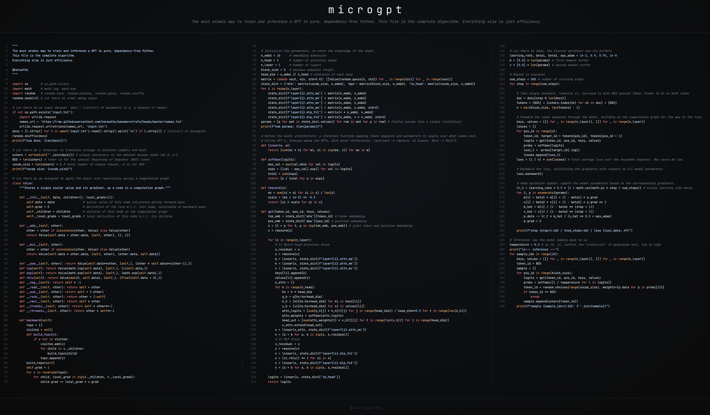

+++
date = '2026-02-18T00:15:56+08:00'
draft = true
title = 'Microgpt 學習筆記'
tags = ['microgpt']
categories = ['AI']
keywords = ['']
description = ''
excerpt = ''
image = ''
comments = true
author = '海狸大師'
authorLink = 'https://github.com/yenslife'
+++

# Microgpt 學習筆記

Microgpt 是 Andrej Karpathy 最近的「art project」，用短短的 200 純 Python 程式碼 (不依賴任何外部套件像是 PyTorch)，把 GPT 的訓練和推論過程實作出來，真的非常厲害。於是我打算整理一下他在部落格介紹這個專案的文章以及程式碼做一個簡單的心得整理。從程式碼以及 Python 新手的角度來理解這個專案，如果寫不完就分個上下集好了。

> Microgpt: https://karpathy.ai/microgpt.html
>
> Microgpt GitHub Gist: https://gist.github.com/karpathy/8627fe009c40f57531cb18360106ce95
>
> Andrej Karpathy 的部落格原文: https://karpathy.github.io/2026/02/12/microgpt/



## 資料集 (Datasets)

我們都知道語言模型的輸入就是文字，對於 production 的專案，每一份文件可能是網頁這類的資料，但對於 microgpt 則使用 32000 個名字當作輸入，每一行都是一個名字。畢竟是 microgpt 嘛，從資料集也可以猜到 Karpathy 的 microgpt 實際上就是一個可以生成「假名字」的模型。或者說一個可以「幻覺 (hallucinate)」出名字的模型。

```python
# Let there be an input dataset `docs`: list[str] of documents (e.g. a dataset of names)
if not os.path.exists('input.txt'):
    import urllib.request
    names_url = 'https://raw.githubusercontent.com/karpathy/makemore/refs/heads/master/names.txt'
    urllib.request.urlretrieve(names_url, 'input.txt')
docs = [l.strip() for l in open('input.txt').read().strip().split('\n') if l.strip()] # list[str] of documents
random.shuffle(docs)
print(f"num docs: {len(docs)}")
```

如果你有點開程式碼中的這個連結，可以看到下面這樣的資料，`docs` 是一個以名字為元素的 list

```plain
emma
olivia
ava
isabella
sophia
charlotte
(以下省略)
```

## 分詞器 (Tokenizer)

因為語言模型是看不懂字元的，他們只看得懂數字，所以我們需要一個 tokenizer 來將文字切割成一個一個 ID，這邊用 26 個英文單字作為簡單的 ID，不過還沒完，因為我們需要讓 LLM 知道何時開始與何時結束，所以還需要一個特別的 ID，也就是 BOS (Beginning of Sequence)。所以總共會有 26 + 1 個 Token。

在之後的訓練中，我們會在每一筆訓練資料的頭尾都加上這個 BOS token，好讓模型學會開始和結束的時機。

```python
# Let there be a Tokenizer to translate strings to discrete symbols and back
uchars = sorted(set(''.join(docs))) # unique characters in the dataset become token ids 0..n-1
BOS = len(uchars) # token id for the special Beginning of Sequence (BOS) token
vocab_size = len(uchars) + 1 # total number of unique tokens, +1 is for BOS
print(f"vocab size: {vocab_size}")
```

## 自動梯度/微分 (Autograd)

> Autograd = Auto (自動) + Gradient (梯度)

訓練一個模型需要計算梯度，也就是「如果稍微調整這個數值，最後的 Loss 會變高還是變低？」計算圖 (Computation Graph) 有許多輸入 (因為模型的參數很多)，但最終就只會有一個輸出：Loss 值。反向傳播演算法 (Backpropagation) 從一個 output 開始在這個計算圖上往回推，算出每一個 input 的梯度，這麼神奇的背後其實就是微積分的連鎖律 (Chain Rule)。現有的深度學習套件像是 PyTorch 把計算梯度這件事變得很簡單，但是在 Microgpt 中我們不依賴任何外部套件，所以計算梯度這件事我們要實作出來！

這邊要解釋一下計算圖 (Computation Graph) 是什麼，這是一種把一系列複雜的運算轉換成圖來表示的東東，節點 (Node) 代表數學運算 (加減乘除等等)，邊 (Edge) 則是要傳遞的數值。正向傳播 (Forward Pass) 就只要順著這個圖就可以算出最終的 Loss；而反向傳播 (Backword Pass) 就是反過來。

### Value Class

`Value` 這個 class 包含一個 `.data` 屬性，用來存這個參數的值，你可以把每個運算想成是一個樂高積木，它接收一個輸入值，每次 forward pass 都會算出一個結果，順便算出產生這樣的 output 相對於 input 而言的變化量也就是 local gradient。只要有這些資訊就可以實作 autograd 了

這邊 Karpathy 用了一個 Python 的技巧 `__slots__`，讓 class 不再使用 `__dict__` 來存類別的屬性。Python 預設使用 `__dict__` 來存屬性，每個物件都有一個 `__dict__` 屬性，這個 `__dict__` 就是一個 hash table，就是 Python 的 dictionary 啦，我們都知道 dictionary 有很多內建的功能，這也讓它用起來會佔用較多**記憶體**。改用 `__slots__` 則是用 offsets 來取值。啊所以有什麼差？簡單來說改成 `__slots__` 就不能動態新增屬性了，但卻能省下很多記憶體空間。

```python
class Value:
    __slots__ = ('data', 'grad', '_children', '_local_grads')

    def __init__(self, data, children=(), local_grads=()):
        self.data = data                # scalar value of this node calculated during forward pass
        self.grad = 0                   # derivative of the loss w.r.t. this node, calculated in backward pass
        self._children = children       # children of this node in the computation graph
        self._local_grads = local_grads # local derivative of this node w.r.t. its children
    (以下省略，稍後會提到)
```

每當用 `Value` 來做運算 (加減乘除 ReLU 那些)，都會輸出一個新的 `Value` 物件，這個新的 `Value` 物件包含他的原始輸入 `_children` 以及導數 `_local_grads`。舉例來說，`__mul__` 會紀錄 $\frac{\partial (a \cdot b)}{\partial a} = b$ 以及 $ \frac{\partial (a \cdot b)}{\partial b} = a$，完整的樂高積木如下：

| Operation | Forward | Local gradients |
|----------|---------|----------------|
| `a + b` | $a + b$ | $\frac{\partial}{\partial a}=1,\ \frac{\partial}{\partial b}=1$ |
| `a * b` | $a \cdot b$ | $\frac{\partial}{\partial a}=b,\ \frac{\partial}{\partial b}=a$ |
| `a ** n` | $a^n$ | $\frac{\partial}{\partial a}=n\,a^{n-1}$ |
| `log(a)` | $\ln(a)$ | $\frac{\partial}{\partial a}=\frac{1}{a}$ |
| `exp(a)` | $e^a$ | $\frac{\partial}{\partial a}=e^a$ |
| `relu(a)` | $\max(0,a)$ | $\frac{\partial}{\partial a}=\mathbf{1}_{a>0}$ |

在 Python 類別定義 `__add__`、`__mul__` 等方法實際上就是在做 operation overloading，當我們在 Python 寫 `a + b` 時，實際上會被轉換成 `a.__add__(b)`，但是 Python 的 overloading (同名異式) 又和 Java 不完全一樣。我們在類別中改了 `__add__` 就會直接把原本的 `__add__` 功能給覆蓋掉。那為什麼這樣不算是 override 呢？因為 Python 的類別都繼承自 `Object`，但是 `Object` 並沒有實作 `__add__` 呀！(不信你可以試試看 `hasattr(object, "__add__")` 看印出的結果)，override 的定義是要去「覆寫繼承類別實作的方法」但 `Object` 並沒有實作這些運算方法，所以不算 override。

```python
    def __add__(self, other):
        other = other if isinstance(other, Value) else Value(other)
        return Value(self.data + other.data, (self, other), (1, 1))

    def __mul__(self, other):
        other = other if isinstance(other, Value) else Value(other)
        return Value(self.data * other.data, (self, other), (other.data, self.data))

    def __pow__(self, other): return Value(self.data**other, (self,), (other * self.data**(other-1),))
    def log(self): return Value(math.log(self.data), (self,), (1/self.data,))
    def exp(self): return Value(math.exp(self.data), (self,), (math.exp(self.data),))
    def relu(self): return Value(max(0, self.data), (self,), (float(self.data > 0),))
    def __neg__(self): return self * -1
    def __radd__(self, other): return self + other
    def __sub__(self, other): return self + (-other)
    def __rsub__(self, other): return other + (-self)
    def __rmul__(self, other): return self * other
    def __truediv__(self, other): return self * other**-1
    def __rtruediv__(self, other): return other * self**-1
```

```python
    def backward(self):
        topo = []
        visited = set()
        def build_topo(v):
            if v not in visited:
                visited.add(v)
                for child in v._children:
                    build_topo(child)
                topo.append(v)
        build_topo(self)
        self.grad = 1
        for v in reversed(topo):
            for child, local_grad in zip(v._children, v._local_grads):
                child.grad += local_grad * v.grad
```

