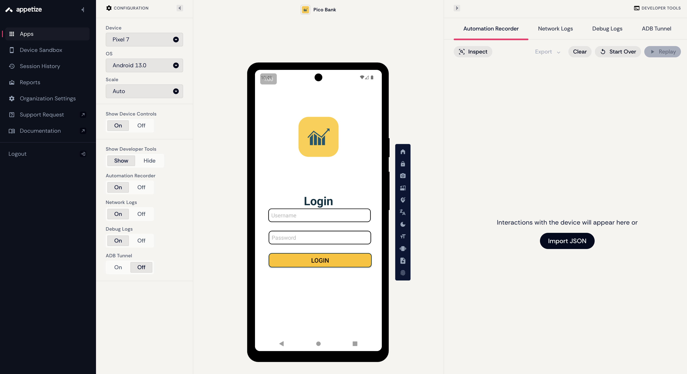
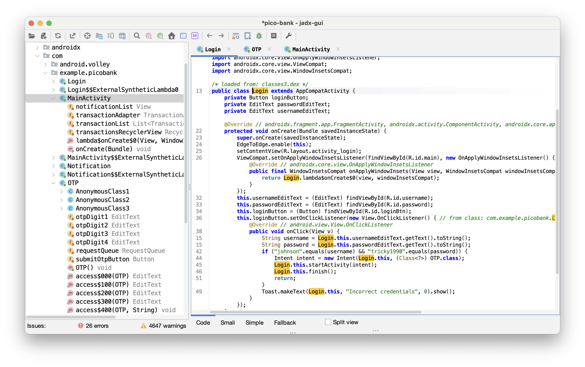
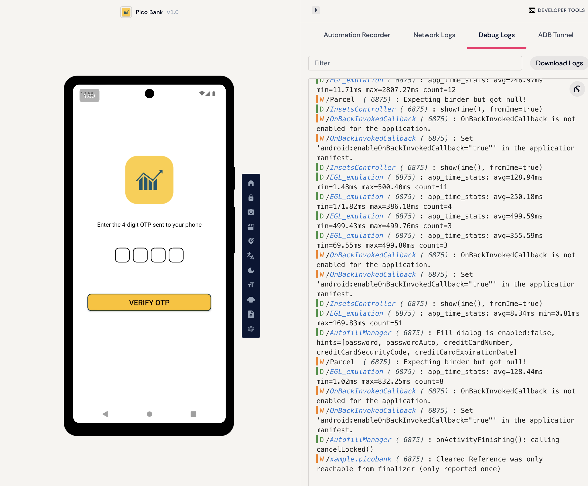
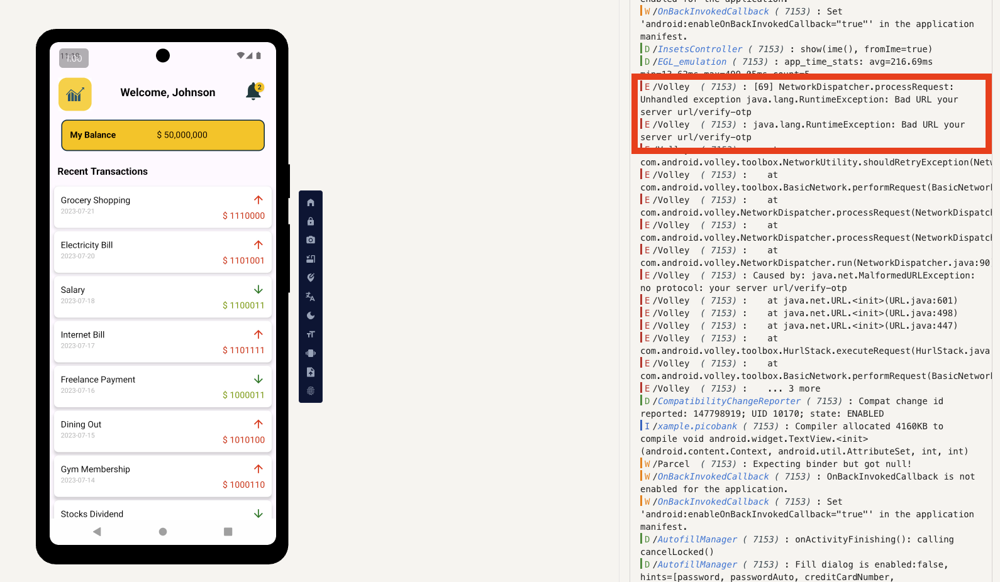

+++
date = '2025-12-04T15:52:44+08:00'
draft = false
title = 'Picoctf Pico Bank Writeup'
image = 'cover.png'
description = ''
readingTime = true
keywords = ['PicoCTF', 'Reverse Engineering'] # for seo
categories = ['CTF']
tags = ['picoMini by CMU-Africa']
+++

## 前言

這是一題出現在 picoMini by CMU-Africa 的題目，因為只有 43% 的人喜歡，解出來的人也只有 322 個，我覺得很有意思所以寫了這個 write-up。

題目連結：[Pico Bank](https://play.picoctf.org/practice/challenge/529?originalEvent=77&page=1) 

題目會給一個 instance，在瀏覽器開啟這個連結可以看到一個叫 Pico Bank 的網頁，你可以在這個網頁找到下載 `pico-bank.apk` 檔案的連結。除此之外，題目的提示有提到一個叫做 johnson 的人，這是很重要的線索。題目也提示了 Flag 會出現在兩個地方，一個是 transaction 的特別數字；另一個則是發送 otp 認證的方式。


## 解法

### 執行 apk

這邊我並沒有使用 Android Studio 等本地虛擬機 (因為我的硬碟快爆了哈哈哈)，而是一個可以線上使用虛擬機的網站： https://appetize.io/ 。他唯一的缺點就是若超過 3 分鐘沒有和虛擬機互動，該 Session 就會被關掉，但對於免費仔來說已經很夠用了。

建立新的專案然後把 apk 檔案放進去，就會遇到第一個關卡 --> 找出帳號密碼



### 反編譯 pico-bank.apk

這邊我先用 [`apktool`](https://apktool.org/) 工具來進行反編譯，也可以直接用 [jadx-gui](https://github.com/skylot/jadx) 來看 `.apk` 檔案的 Java source。apktool 的輸出語言是 smali，你可以修改內容重新編譯 (像是把帳號密碼改成你要的之類的)；而 jadx 則是嘗試將 .dex 還原成 Java 但有時候也會怪怪的，看情況使用吧！我是都第一次用所以就都下載來玩了

```bash
$ apktool d pico-bank.apk
I: Using Apktool 2.12.1 on pico-bank.apk with 8 threads
I: Baksmaling classes.dex...
I: Loading resource table...
I: Baksmaling classes3.dex...
I: Baksmaling classes2.dex...
I: Decoding file-resources...
I: Loading resource table from file: /Users/mac/Library/apktool/framework/1.apk
I: Decoding values */* XMLs...
I: Decoding AndroidManifest.xml with resources...
I: Copying original files...
I: Copying unknown files...
```



觀察 `pico-bank` 目錄底下的內容，用 VSCode 或者 Telescope 等能夠搜尋目錄檔案內容的工具查詢 "johnson"，會發現在 `pico-bank/smali_classes3/com/example/picobank/Login$1.smali` 這個檔案有以下線索，其中就包含 username 和 password 寫死的值，分別為 `johnson` 和 `tricky1990`。


```asm
# virtual methods
.method public onClick(Landroid/view/View;)V
    .locals 5
    .param p1, "v"    # Landroid/view/View;

    .line 39
    iget-object v0, p0, Lcom/example/picobank/Login$1;->this$0:Lcom/example/picobank/Login;

    invoke-static {v0}, Lcom/example/picobank/Login;->access$000(Lcom/example/picobank/Login;)Landroid/widget/EditText;

    move-result-object v0

    invoke-virtual {v0}, Landroid/widget/EditText;->getText()Landroid/text/Editable;

    move-result-object v0

    invoke-virtual {v0}, Ljava/lang/Object;->toString()Ljava/lang/String;

    move-result-object v0

    .line 40
    .local v0, "username":Ljava/lang/String;
    iget-object v1, p0, Lcom/example/picobank/Login$1;->this$0:Lcom/example/picobank/Login;

    invoke-static {v1}, Lcom/example/picobank/Login;->access$100(Lcom/example/picobank/Login;)Landroid/widget/EditText;

    move-result-object v1

    invoke-virtual {v1}, Landroid/widget/EditText;->getText()Landroid/text/Editable;

    move-result-object v1

    invoke-virtual {v1}, Ljava/lang/Object;->toString()Ljava/lang/String;

    move-result-object v1

    .line 42
    .local v1, "password":Ljava/lang/String;
    const-string v2, "johnson"

    invoke-virtual {v2, v0}, Ljava/lang/String;->equals(Ljava/lang/Object;)Z

    move-result v2

    if-eqz v2, :cond_0

    const-string v2, "tricky1990"

    invoke-virtual {v2, v1}, Ljava/lang/String;->equals(Ljava/lang/Object;)Z

    move-result v2

    if-eqz v2, :cond_0

    .line 44
    new-instance v2, Landroid/content/Intent;

    iget-object v3, p0, Lcom/example/picobank/Login$1;->this$0:Lcom/example/picobank/Login;

    const-class v4, Lcom/example/picobank/OTP;

    invoke-direct {v2, v3, v4}, Landroid/content/Intent;-><init>(Landroid/content/Context;Ljava/lang/Class;)V

    .line 45
    .local v2, "intent":Landroid/content/Intent;
    iget-object v3, p0, Lcom/example/picobank/Login$1;->this$0:Lcom/example/picobank/Login;

    invoke-virtual {v3, v2}, Lcom/example/picobank/Login;->startActivity(Landroid/content/Intent;)V

    .line 46
    iget-object v3, p0, Lcom/example/picobank/Login$1;->this$0:Lcom/example/picobank/Login;

    invoke-virtual {v3}, Lcom/example/picobank/Login;->finish()V

    .line 47
    .end local v2    # "intent":Landroid/content/Intent;
    goto :goto_0

    .line 49
    :cond_0
    iget-object v2, p0, Lcom/example/picobank/Login$1;->this$0:Lcom/example/picobank/Login;

    const-string v3, "Incorrect credentials"

    const/4 v4, 0x0

    invoke-static {v2, v3, v4}, Landroid/widget/Toast;->makeText(Landroid/content/Context;Ljava/lang/CharSequence;I)Landroid/widget/Toast;

    move-result-object v2

    invoke-virtual {v2}, Landroid/widget/Toast;->show()V

    .line 51
    :goto_0
    return-void
.end method
```

Android 的 APK 中包含 `.dex` 檔 (Dalvik Executable)，是 Android 執行的 bytecode 格式。因為反組譯沒辦法直接變成 Java code，但還是可以變成人類可讀的 `.smali`，一種類似組合語言的東東。

那上面這段在幹嘛呢？利用 jadx 工具還原成 Java 的 `Login.java` 會像以下這樣
```java
protected void onCreate(Bundle savedInstanceState) {
    super.onCreate(savedInstanceState);
    EdgeToEdge.enable(this);
    setContentView(R.layout.activity_login);
    ViewCompat.setOnApplyWindowInsetsListener(findViewById(R.id.main), new OnApplyWindowInsetsListener() { // from class: com.example.picobank.Login$$ExternalSyntheticLambda0
        @Override // androidx.core.view.OnApplyWindowInsetsListener
        public final WindowInsetsCompat onApplyWindowInsets(View view, WindowInsetsCompat windowInsetsCompat) {
            return Login.lambda$onCreate$0(view, windowInsetsCompat);
        }
    });
    this.usernameEditText = (EditText) findViewById(R.id.username);
    this.passwordEditText = (EditText) findViewById(R.id.password);
    this.loginButton = (Button) findViewById(R.id.loginBtn);
    this.loginButton.setOnClickListener(new View.OnClickListener() { // from class: com.example.picobank.Login.1
        @Override // android.view.View.OnClickListener
        public void onClick(View v) {
            String username = Login.this.usernameEditText.getText().toString();
            String password = Login.this.passwordEditText.getText().toString();
            if ("johnson".equals(username) && "tricky1990".equals(password)) {
                Intent intent = new Intent(Login.this, (Class<?>) OTP.class);
                Login.this.startActivity(intent);
                Login.this.finish();
                return;
            }
            Toast.makeText(Login.this, "Incorrect credentials", 0).show();
        }
    });
}
```

回到 apptized，輸入帳號密碼，會發現這個 App 還要你輸入一個四碼的 otp (one time password) 碼



回到剛剛的 `.smali` 檔案，其中有一行是

```asm
const-class v4, Lcom/example/picobank/OTP;
```

藉著這個線索，我們可以觀察 `pico-bank/smali_classes3/com/exmaple/picobank/OPT.java` 的檔案內容，發現有 `verifyOtp` 這個方法。猜測這是用來檢查 otp 值，也就是 `otp_value`。

```java
public void verifyOtp(String otp) throws JSONException {
    String endpoint = "your server url/verify-otp";
    if (getResources().getString(R.string.otp_value).equals(otp)) {
        Intent intent = new Intent(this, (Class<?>) MainActivity.class);
        startActivity(intent);
        finish();
    } else {
        Toast.makeText(this, "Invalid OTP", 0).show();
    }
    JSONObject postData = new JSONObject();
    try {
        postData.put("otp", otp);
    } catch (JSONException e) {
        e.printStackTrace();
    }
    JsonObjectRequest jsonObjectRequest = new JsonObjectRequest(1, endpoint, postData, new Response.Listener<JSONObject>() { // from class: com.example.picobank.OTP.2
        @Override // com.android.volley.Response.Listener
        public void onResponse(JSONObject response) throws JSONException {
            try {
                boolean success = response.getBoolean("success");
                if (success) {
                    String flag = response.getString("flag");
                    String hint = response.getString("hint");
                    Intent intent2 = new Intent(OTP.this, (Class<?>) MainActivity.class);
                    intent2.putExtra("flag", flag);
                    intent2.putExtra("hint", hint);
                    OTP.this.startActivity(intent2);
                    OTP.this.finish();
                } else {
                    Toast.makeText(OTP.this, "Invalid OTP", 0).show();
                }
            } catch (JSONException e2) {
                e2.printStackTrace();
            }
        }
    }, new Response.ErrorListener() { // from class: com.example.picobank.OTP.3
        @Override // com.android.volley.Response.ErrorListener
        public void onErrorResponse(VolleyError error) {
        }
    });
    this.requestQueue.add(jsonObjectRequest);
}

```

全域搜尋 `otp_value`，在 `pico-bank/res/values/strings.xml` 找到以下 otp 的值

```xml
<string name="otp_value">9673</string>
```

回到 apptized 來輸入 9673 看看！成功登入了！題目有提示我們可以去觀察 Pico Bank 是怎麼發送驗證 otp 請求的、以及交易哪邊怪怪的



首先，誰的交易系統價格會是由 0 和 1 組成！很明顯有鬼；另一方面則是這個 /verify_otp 似乎是一個 post 請求，而且他並沒有寫正確的 url 而是「your server url」這個奇妙的 url 在 `OPT.smali` 這個檔案中。

### 向 PicoCTF 的 instance 發送請求

順著這個套路，我們向剛剛在 PicoCTF 啟動的 instance 發送請求，就找到它ㄌ！

```bash
curl -X POST 'http://amiable-citadel.picoctf.net:58064/verify-otp' \
-H 'Content-Type: application/json; charset=utf-8' \
-H 'Accept: application/json' \
-d '{"otp": "9673"}'
{"success":true,"message":"OTP verified successfully","flag":"s3cur3d_m0b1l3_l0g1n_c0085c75}","hint":"The other part of the flag is hidden in the app"}
```

不過是一半的而已，我們還需要找到前半部

### 解讀 transaction 的奇妙數字

在 MainActivity 中可以看到這些價錢都是由 0 和 1 組成的，我們來寫一個簡單的 Python 腳本處理他們

```java
this.transactionList.add(new Transaction("Grocery Shopping", "2023-07-21", "$ 1110000", false));
this.transactionList.add(new Transaction("Electricity Bill", "2023-07-20", "$ 1101001", false));
this.transactionList.add(new Transaction("Salary", "2023-07-18", "$ 1100011", true));
this.transactionList.add(new Transaction("Internet Bill", "2023-07-17", "$ 1101111", false));
this.transactionList.add(new Transaction("Freelance Payment", "2023-07-16", "$ 1000011", true));
this.transactionList.add(new Transaction("Dining Out", "2023-07-15", "$ 1010100", false));
this.transactionList.add(new Transaction("Gym Membership", "2023-07-14", "$ 1000110", false));
this.transactionList.add(new Transaction("Stocks Dividend", "2023-07-13", "$ 1111011", true));
this.transactionList.add(new Transaction("Car Maintenance", "2023-07-12", "$ 110001", false));
this.transactionList.add(new Transaction("Gift Received", "2023-07-11", "$ 1011111", true));
this.transactionList.add(new Transaction("Rent", "2023-07-10", "$ 1101100", false));
this.transactionList.add(new Transaction("Water Bill", "2023-07-09", "$ 110001", false));
this.transactionList.add(new Transaction("Interest Earned", "2023-07-08", "$ 110011", true));
this.transactionList.add(new Transaction("Medical Expenses", "2023-07-07", "$ 1100100", false));
this.transactionList.add(new Transaction("Transport", "2023-07-06", "$ 1011111", false));
this.transactionList.add(new Transaction("Bonus", "2023-07-05", "$ 110100", true));
this.transactionList.add(new Transaction("Subscription Service", "2023-07-04", "$ 1100010", false));
this.transactionList.add(new Transaction("Freelance Payment", "2023-07-03", "$ 110000", true));
this.transactionList.add(new Transaction("Entertainment", "2023-07-02", "$ 1110101", false));
this.transactionList.add(new Transaction("Groceries", "2023-07-01", "$ 1110100", false));
this.transactionList.add(new Transaction("Insurance Premium", "2023-06-28", "$ 1011111", false));
this.transactionList.add(new Transaction("Charity Donation", "2023-06-26", "$ 1100010", true));
this.transactionList.add(new Transaction("Vacation Expense", "2023-06-26", "$ 110011", false));
this.transactionList.add(new Transaction("Home Repairs", "2023-06-24", "$ 110001", false));
this.transactionList.add(new Transaction("Pet Care", "2023-06-22", "$ 1101110", false));
this.transactionList.add(new Transaction("Personal Loan", "2023-06-18", "$ 1100111", true));
this.transactionList.add(new Transaction("Childcare", "2023-06-15", "$ 1011111", false));

```

取出這段文字 `"$` 開頭的部分，將後面的數字從 binary 轉換成 ascii

```python
# tmp.py
import re

source = "" # 這邊放上面的字串

# 抓出所有 "$ xxxx" 的 0/1 字串
binaries = re.findall(r'\$ ?([01]+)', source)

output = ""
for b in binaries:
    try:
        output += chr(int(b, 2))
    except:
        output += '?'

print("Binary → ASCII:")
print(output)
```
執行就可以找到前半部分的 Flag 了喔！
```bash
$ uv run tmp.py
Binary → ASCII:
picoCTF{1_l13d_4b0ut_b31ng_
```

## 結論

這題我找不到網路上有人寫 write-up，可能因為出得太靠北了，導致這麼低的喜歡率。不過我覺得還蠻有趣的，我一開始沒有使用 jadx 這類的工具來將 apk 轉換成看得懂的 Java code，而是直接閱讀 .smali 檔案，真的是有病哈。我一直以為是要用 apktool 修改 request url，看 App 會跳出什麼線索，後來覺得不對呀，我都有 source code 而且還是沒有特別混淆過的，那就直接打看看 instance 吧！會有這樣的想法是因為這次的另一個 reverse engineering 題目是直接提供 apk 下載連結，而不用特別開 instance，那這題肯定有鬼呀，結果就通靈到了，開開心心
